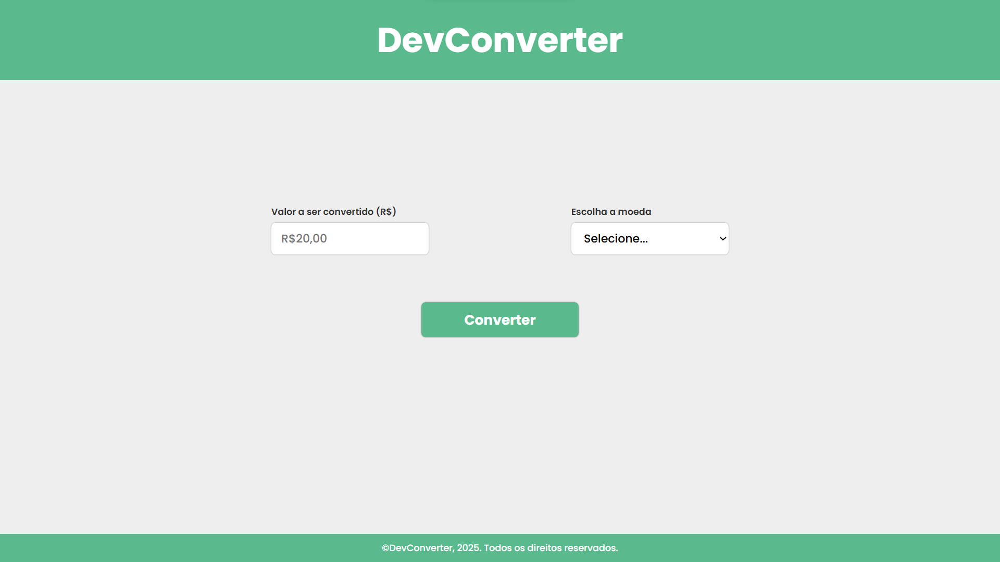

# 💱 DevConverter

**DevConverter** é um conversor de moedas desenvolvido com HTML, CSS e JavaScript. O usuário insere um valor em Reais (R$) e seleciona se deseja converter para Euro (€) ou Dólar (US$). O resultado é exibido na tela de forma formatada e com animação.

## 🚀 Demonstração

---

## 🛠️ Tecnologias Utilizadas

- **HTML5**  
- **CSS3**  
- **JavaScript (Vanilla JS)**

---

## 📦 Funcionalidades

- Conversão de valores em Reais para:
  - Euro (€)
  - Dólar Americano (US$)
- Validação de formulário
- Interface amigável
- Animação ao exibir o resultado

---

## ⚙️ Como Usar

1. Clone este repositório ou baixe o `.zip` do projeto.
2. Extraia o conteúdo e abra o arquivo `index.html` no navegador.
3. Insira um valor em reais.
4. Escolha a moeda para conversão.
5. Clique em "Converter" e veja o resultado.

---

## 💡 Observações

- As taxas de câmbio são **fixas e fictícias**:
  - **1 EUR = R$6,42**
  - **1 USD = R$5,48**
- Para usar taxas reais, seria necessário integrar com uma API de câmbio (ex: [exchangerate-api.com](https://www.exchangerate-api.com/)).

---

## 📄 Licença

Este projeto está licenciado sob a **MIT License**.
